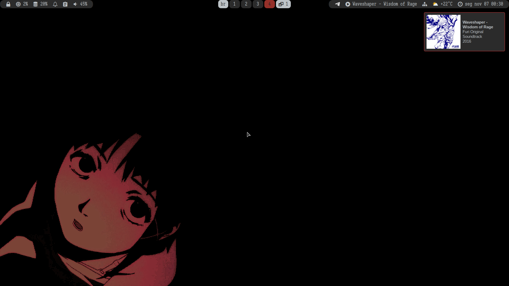
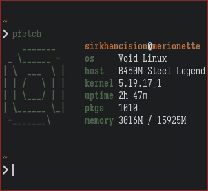
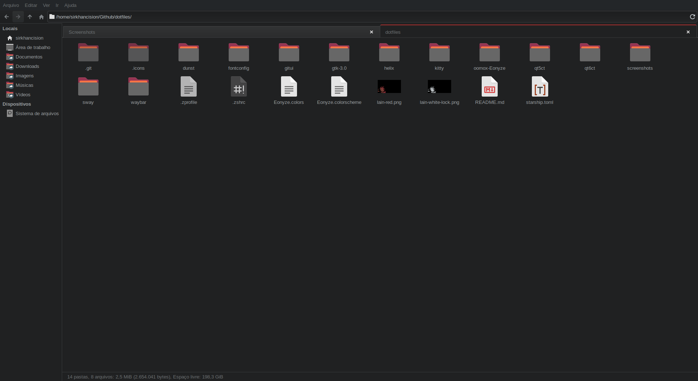

## dotfiles

A set of configuration files for my personal system (Void Linux). Refer to ***void_install.sh*** to automate a lot of this process.

**Arimo Nerd Font:** Font with a multitude of different characters and modes.

> `xbps-install nerd-fonts`

**cz-Hickson (Black):** Cursor theme used.

> <https://www.pling.com/p/1503665>

**Eonyze.colors:** Plasma color theme with a black-and-white-and-red color palette.

> `~/.local/share/color-schemes`

**Eonyze.colorscheme:** Konsole/Yakuake color scheme, modified from [_Moe-Dark_](https://store.kde.org/p/1378415) and my custom version of [_Dark Warmth_](https://store.kde.org/p/1283955/) theme.

> `~/.local/share/konsole`

**dunst:** Configuration for the dunst notification manager.

> `~/.config/dunst`

**fontconfig/fonts.conf:** Configuration file for system-wide fonts.

> `~/.config/fontconfig`

**gitui:** Theme configuration for gitui.

> `~/.config/gitui`

**gtk-3.0:** Configuration for GTK3 apps.

> `~/.config/gtk-3.0`

**helix:** Configuration file for the Helix text editor.

> `~/.config/helix`

**.icons:** Configuration to set the cursor theme.

> `~/.icons`

**Iosevka Nerd Font:** Monospaced font with ligatures and various modes.

> `xbps-install font-iosevka`

**kitty:** Configuration for the kitty terminal.

> `~/.config/kitty`

**lain-red.png**: Wallpaper slightly edited by me with Lain from Serial Experiments Lain.

**lain-white-lock.png**: Slightly modified version of the aforementioned wallpaper, for use on the lock screen.

**oomox/colors/Eonyze:** Oomox/Themix file for the GTK Eonyze theme.

> `~/.config/oomox/colors`

**oomox-Eonyze**: GTK 3/4 themes from Eonyze color scheme. Made by me.

> `~/.themes`

**papirus-folders**: Black theme used.

**qt5ct/qt6ct:** Themes for QT5 and QT6 applications, using the GTK Eonyze colorscheme along with the Fusion style.

> `~/.config/qt5ct/colors`

> `~/.config/qt6ct/colors`

**Starship:** Prompt written in Rust.

> `xbps-install starship`

**starship.toml:** Configuration file for Starship.

> `~/.config`

**Sway config:** Sway's configuration directory.

> `~/.config/sway`

**void_install.sh:** Script to do a lot of post-install stuff on my Void Linux system.

**waybar:** Directory containing Waybar's configuration files.

> `~/.config/waybar`

**wlogout:** Wlogout's configuration directory, along with custom icons.

> `~/.config/wlogout`

**.zprofile:** ZSH's profile of commannds to be executed when logged in, user-wide.

> `~/.zprofile`

**.zshrc:** ZSH's main file with general configurations and aliases.

> `~/.zshrc`
