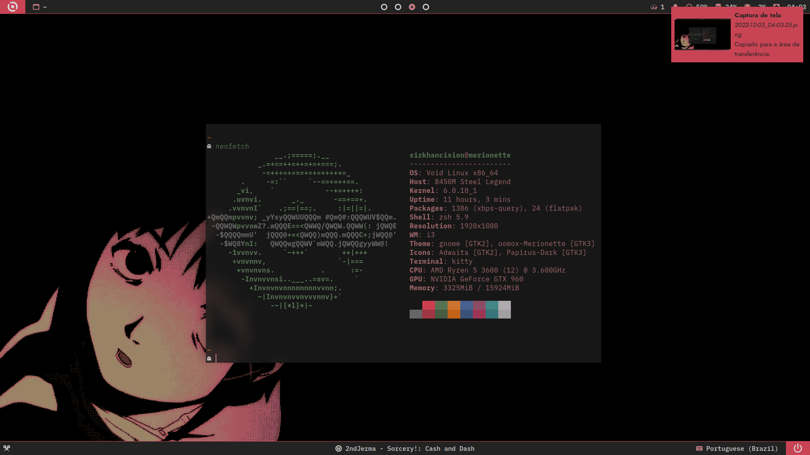
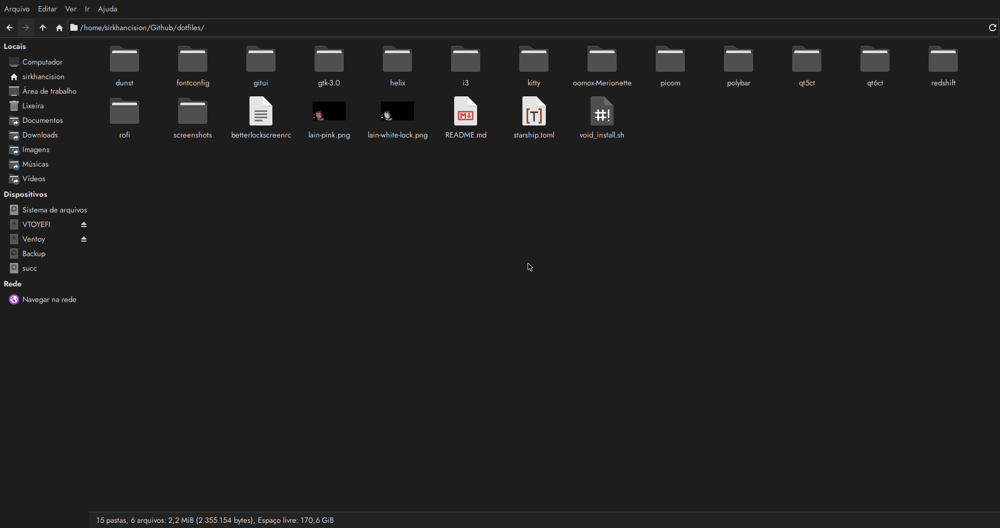

## dotfiles

A set of configuration files for my personal system (Void Linux). Refer to ***void_install.sh*** to automate a lot of this process.

**System's fonts:** 
- _Sans-serif:_ [Jost](https://fonts.google.com/specimen/Jost)
- _Monospaced:_ [IBM Plex Mono](https://fonts.google.com/specimen/IBM+Plex+Mono)
**Cursor theme:** [Bibata-Modern-Classic](https://www.pling.com/p/1914825)

**dunst:** Configuration for the dunst notification manager.

> `~/.config/dunst`

**fontconfig/fonts.conf:** Configuration file for system-wide fonts.

> `~/.config/fontconfig`

**gitui:** Theme configuration for gitui.

> `~/.config/gitui`

**gtk-3.0:** Configuration for GTK3 apps.

> `~/.config/gtk-3.0`

**helix:** Configuration file for the Helix text editor.

> `~/.config/helix`

**i3 config:** i3wm's configuration directory.

> `~/.config/i3`

**.icons:** Configuration to set the cursor theme.

> `~/.icons`

**kitty:** Configuration for the kitty terminal.

> `~/.config/kitty`

**lain-pink.png**: Wallpaper slightly edited by me, portraying Lain Iwakura from Serial Experiments Lain.

**lain-white-lock.png**: Slightly modified version of the aforementioned wallpaper, for use on the lock screen.

**oomox-Merionette**: GTK 2/3 themes from Merionette color scheme. Made by me.

> `~/.themes`

**papirus-folders**: Black theme used.

**Picom:** Configuration for the picom compositor.

> `~/.config/picom`

**Polybar:** Directory containing Polybar's configuration files.

> `~/.config/polybar`

**qt5ct/qt6ct:** Themes for QT5 and QT6 applications, using the GTK Eonyze colorscheme along with the Fusion style.

> `~/.config/qt5ct/colors`

> `~/.config/qt6ct/colors`

**Redshift:** Configuration for Redshift (screen temperature/gamma adjuster).

> `~/.config/redshift`

**Rofi:** Configured from [adi109x's fork of Rofi](https://github.com/adi1090x/rofi).

> `~/.config/rofi`

**Starship:** Prompt written in Rust.

> `xbps-install starship`

**starship.toml:** Configuration file for Starship.

> `~/.config`

**void_install.sh:** Script to do a lot of post-install stuff on my Void Linux system.

**.zprofile:** ZSH's profile of commannds to be executed when logged in, user-wide.

> `~/.zprofile`

**.zshrc:** ZSH's main file with general configurations and aliases.

> `~/.zshrc`
