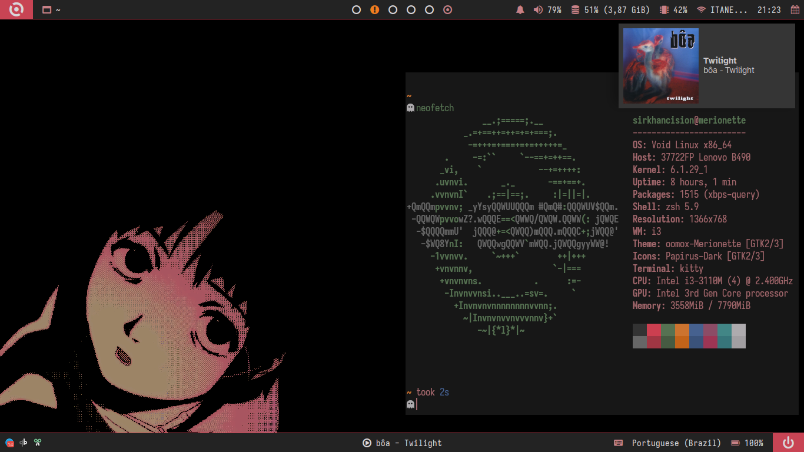
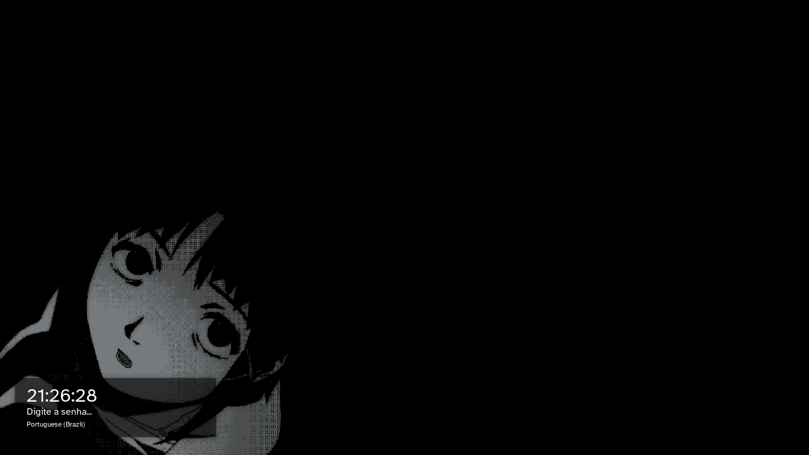

# dotfiles

A set of configuration files for my personal system (Void Linux). Refer to **dotman** to automate a lot of this process. There's also **void_install.sh**, to automate stuff after installing Void Linux.

---

**System's fonts:** 

- _Sans-serif:_ [Atkinson Hyperlegible](https://brailleinstitute.org/freefont)
	- `xbps-install font-atkinson-hyperlegible-otf`
- _Monospaced:_ [Iosevka Fixed](https://github.com/be5invis/Iosevka)
	- `xbps-install font-iosevka`

**Cursor theme:** Breeze Obsidian

`xbps-install breeze-obsidian-cursor-theme`

**.config/dunst:** Configuration for the dunst notification manager.

`xbps-install dunst`

**.config/fontconfig/fonts.conf:** Configuration file for system-wide fonts.

**.config/gitui:** Theme configuration for gitui.

`xbps-install gitui`

**.config/gtk-3.0:** Configuration for GTK3 apps.

**.config/helix:** Configuration file for the Helix text editor.

`xbps-install helix`

**.config/i3:** i3wm's configuration directory.

`xbps-install i3-gaps`

**dotman:** Python script to manage dotfiles ([here's its readme](https://github.com/sirkhancision/dotfiles/blob/i3wm/DOTMAN_README.md)).

`./dotman`

**.icons:** Configuration to set the cursor theme.

**/boot/grub/themes/lain-glitch-theme:** Theme for GRUB based on Serial Experiments Lain.

**/usr/share/sddm/themes/sugar-candy:** Theme for SDDM, modified from [sugar-candy](https://store.kde.org/p/1312658/).

`xbps-install sddm`

**.config/kitty:** Configuration for the kitty terminal.

`xbps-install kitty`

**.config/nnn:** Configuration for the file manager nnn.

`xbps-install nnn`

**lain-pink.png**: Wallpaper slightly edited by me, portraying Lain Iwakura from Serial Experiments Lain. (with variant for laptops)

**lain-white-lock.png**: Slightly modified version of the aforementioned wallpaper, for use on the lock screen. (with variant for laptops)

**.themes/oomox-Merionette**: GTK 2/3 themes from Merionette color scheme. Made by me.

**papirus-folders**: Black theme used.

`xbps-install papirus-folders`

**.config/picom:** Configuration for the picom compositor.

`xbps-install picom`

**.config/polybar:** Directory containing Polybar's configuration files.

`xbps-install polybar`

**.config/qt5ct && .config/qt6ct:** Themes for QT5 and QT6 applications, using the GTK Eonyze colorscheme along with the Fusion style.

`xbps-install qt5ct qt6ct`

**.config/redshift:** Configuration for Redshift (screen temperature/gamma adjuster).

`xbps-install redshift`

**.config/rofi:** Configured from [adi109x's fork of Rofi](https://github.com/adi1090x/rofi).

`xbps-install rofi`

**starship:** Prompt written in Rust.

`xbps-install starship`

**.config/starship.toml:** Configuration file for Starship.

**void_install.sh:** Script to do a lot of post-install stuff on my Void Linux system.

**.Xkbmap:** Keyboard layout configuration for X11.

**.xprofile:** X11 profile of commands to be executed when logged in, user-wide.

**.zshrc:** ZSH's main file with configurations, aliases and functions.
